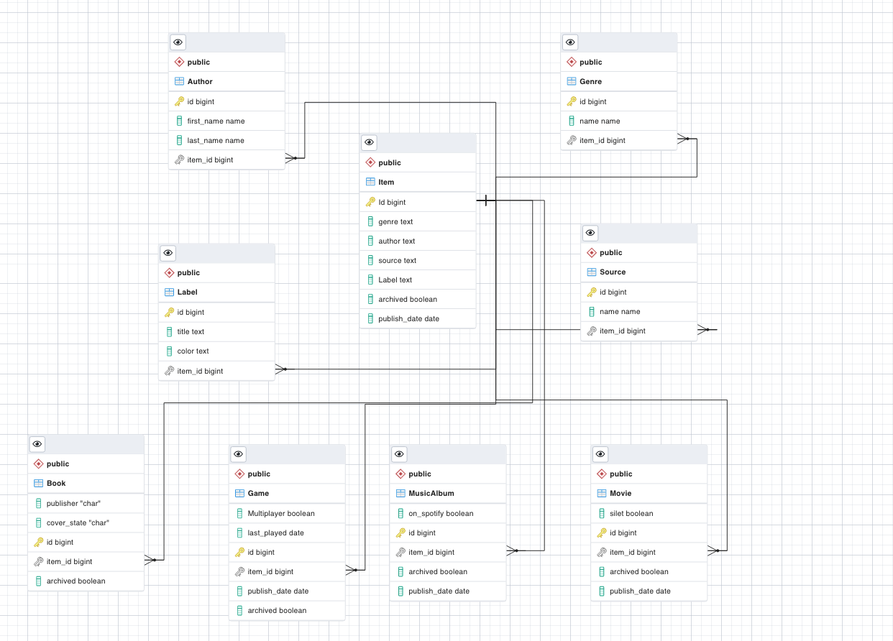

<a name="readme-top"></a>

<!-- TABLE OF CONTENTS -->

# 📗 Table of Contents

- [📖 About the Project](#about-project)
  - [🛠 Built With](#built-with)
    - [Tech Stack](#tech-stack)
    - [Key Features](#key-features)
  - [🚀 Live Demo](#live-demo)
- [💻 Getting Started](#getting-started)
  - [Setup](#setup)
  - [Prerequisites](#prerequisites)
  - [Install](#install)
  - [Usage](#usage)
  - [Run tests](#run-tests)
  - [Deployment](#triangular_flag_on_post-deployment)
- [👥 Authors](#authors)
- [🔭 Future Features](#future-features)
- [🤝 Contributing](#contributing)
- [⭐️ Show your support](#support)
- [🙏 Acknowledgements](#acknowledgements)
- [❓ FAQ](#faq)
- [📝 License](#license)

<!-- PROJECT DESCRIPTION -->

# 📖 Catalog of my things - Ruby capstone <a name="about-project"></a>

> This is the Catalog of my things app initiated in the fifth week of the fourth module in the Microverse program. It is a simple database app to catalog entertainment content (Books, Music, Games).

## 🛠 Built With <a name="built-with"></a>

    
    
    
    - Visual Studio Code
    - Ruby
    - Rspec


 ## App ScreenShot
  
 ## Video Preview

 [Video](Comming Soon)

 ## SQL schema
   


### Key Features <a name="key-features"></a>

<!-- > Describe between 1-3 key features of the application. -->

- Present the user with a list of options to choose and perform.
- Allow users to enter the parameter for their option
- Preserve data by saving collections in .json files
- Present a way for the users to quit the app

<p align="right">(<a href="#readme-top">back to top</a>)</p>

<!-- GETTING STARTED -->

## 💻 Getting Started <a name="getting-started"></a>

<!-- > Describe how a new developer could make use of your project. -->

To get a local copy up and running, follow these steps.

### Prerequisites

In order to run this project you need:

### Setup

Clone this repository to your desired folder:

```
 git@github.com:mrkamin/Catalog-my-things.git
```

### Install

Install this project with:

```
  bundle install
```


### Usage

To run the project, execute the following command:

```
ruby main.rb
```

### Run tests

To run tests, run the following command:

```
 ruby -I test
```

<p align="right">(<a href="#readme-top">back to top</a>)</p>

<!-- AUTHORS -->

## 👥 Author <a name="authors"></a>

<!-- > Mention all of the collaborators of this project. -->
👤 **Mohammad Rafi Amin**

- GitHub: [@githubhandle](https://github.com/mrkamin)
- Twitter: [@twitterhandle](https://twitter.com/Mohamma63974237)
- LinkedIn: [LinkedIn](https://www.linkedin.com/in/mohammad-rafi-amin-63b4319b/)

👤 **Henschel Nketchogue M.**

- GitHub: [miltonHenschel](https://github.com/miltonHenschel)
- LinkedIn: [miltonhenschel](https://www.linkedin.com/in/miltonhenschel/)
- Twitter: [nketchogue](https://twitter.com/nketchogue)


👤 **Francis Uche .**

- GitHub: [francis3400](https://github.com/francis3400)
- LinkedIn: [francis-uche](https://www.linkedin.com/in/francis-uche/)
- Twitter: [francisblinkz](https://twitter.com/francisblinkz)
<p align="right">(<a href="#readme-top">back to top</a>)</p>

<!-- FUTURE FEATURES -->

 ## 🔭 Future Features <a name="future-features"></a> 

<!-- > Describe 1 - 3 features you will add to the project. -->

 - Add more classes
 - Implement more features

<p align="right">(<a href="#readme-top">back to top</a>)</p>

<!-- CONTRIBUTING -->

## 🤝 Contributing <a name="contributing"></a>

Contributions, issues, and feature requests are welcome!

Feel free to check the [issues page](https://github.com/mrkamin/Catalog-my-things/issues).

<p align="right">(<a href="#readme-top">back to top</a>)</p>

<!-- SUPPORT -->

 ## ⭐️ Show your support <a name="support"></a> 

If you like this project, Please give it a ⭐️⭐️

<p align="right">(<a href="#readme-top">back to top</a>)</p>

<!-- ACKNOWLEDGEMENTS -->

 ## 🙏 Acknowledgments <a name="acknowledgements"></a>

Thanks [@microverse](https://www.microverse.org/)

<p align="right">(<a href="#readme-top">back to top</a>)</p>

## 📝 License <a name="license"></a>

This project is [MIT](https://github.com/mrkamin/Catalog-my-things/blob/Dev/LICENSE) licensed.

<p align="right">(<a href="#readme-top">back to top</a>)</p>
